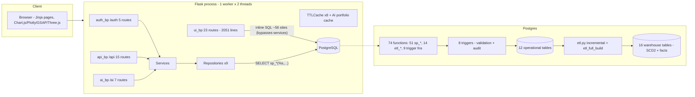

# InventoryLogix — Project Analysis Report

**Merged from both analysis passes · September 10, 2026**
Evidence levels: **E1** direct · **E2** strong inference · **E3** interpretation · **E4** unknown.
Value levels: **Implemented** · **Measured** · **Potential** · **Synthetic**.

---

## 1. Executive Summary

InventoryLogix is a single-tenant, full-stack Flask + PostgreSQL web
application for warehouse inventory management and logistics optimization.
It unifies real-time CRUD (products, suppliers, stock movements, purchase
orders), classical inventory optimization (EOQ), ML demand forecasting
(Prophet/ARIMA ensemble with moving-average fallback), anomaly detection
(Isolation Forest + SPC), and a Kimball-style star-schema data warehouse
with an ETL pipeline — served through a role-protected, dark-mode UI with
glassmorphism, GSAP animations, and Three.js 3D backgrounds.

**Verified key metrics:**
- 97 automated tests (pytest)
- 74 SQL functions (51 `sp_*` + 14 `etl_*` + 9 trigger functions); 8 triggers
- 12 operational + 16 warehouse tables; 50 routes; 49 indexes
- 180,000+ seeded transactions from DataCo SMART SUPPLY CHAIN (CSV gitignored; deterministic synthetic fallback) [E2]
- 118 products, up to 150 suppliers, 10 warehouses in demo data
- SCD Type 2 dimensions with incremental ETL

The project demonstrates production-grade practices unusual for a student
project, with honest limitations documented throughout this report:
in-process security state, a likely-silent background ETL thread, a
committed database credential, a Render blueprint mismatch, and dashboard
"benefit" numbers that are model-derived rather than measured outcomes.

## 2. Project Overview

### 2.1 What is InventoryLogix?
An **Inventory Command Center** that unifies real transaction data with
machine learning into a single dashboard, transforming raw stock
movements into actionable replenishment decisions — helping organizations
reduce stockouts and carrying costs.

### 2.2 Why does it exist?
Traditional spreadsheet-based approaches lack real-time cross-warehouse
visibility, demand forecasting, anomaly detection, order-quantity
optimization, and audit trails. The code addresses each gap directly (see §3).

### 2.3 Core Value Proposition
The differentiating mechanism is the **integrated EOQ + 3D sensitivity
surfaces** — a live EOQ calculator visualizing cost curves in 3D per
product, paired with real transaction history and ML forecasts. No
comparable product combines real dataset grounding, ML demand
forecasting, anomaly detection, and interactive EOQ optimization in one
open-stack Flask application. [E2]

| Attribute | Value |
|---|---|
| Type | Server-rendered web app + REST API |
| Scale | 50 routes · 74 SQL functions · 28 tables · 97 tests · 73 commits |
| Roles | viewer (read-only), manager/admin (write) |
| Author | Single developer (UmerAnsari-developer), 71 of 73 commits |
| Tracked history | 2026-08-15 → 2026-09-10 (27 days); core predates git (big-bang import: 96 files, 15,240 lines) |

## 3. Business Problem

Supply chain managers and warehouse operators face:

| Challenge | Impact | Traditional Solution |
|-----------|--------|------------------|
| **Stockout prevention** | Lost sales, dissatisfaction | Manual reorder points from memory |
| **Carrying-cost optimization** | Idle capital, obsolescence | Spreadsheet tracking, gut-feel quantities |
| **Demand variability** | Inaccurate forecasts | Gut feeling |
| **Anomaly detection** | Theft, damage, data errors | Manual audits |
| **Multi-warehouse coordination** | Inconsistent stock levels | Phone calls/emails |
| **Compliance** | Audit failures | Paper trails |

Code-level targeting (E1): reorder query
`current_stock <= reorder_point AND on_order <= 0` (ui.py:96-100);
EOQ + sensitivity (eoq_service.py:48-80); auto-draft capped at 6 months
demand (ui.py:502-506); SCD2 warehouse (warehouse.sql); IF + SPC
(anomaly.py); forecasting (forecasting.py).

## 4. Business Need

A low-cost, self-hostable system that turns raw stock movements into
daily replenishment decisions without paid SaaS subscriptions or ERP
implementation projects. The deployment story (Render free tier, auto
schema+seed on first boot, zero license cost) targets exactly this. [E2]

## 5. Objectives

**Primary** (PRODUCT.md, E1):
1. Unify real transaction data, ML forecasting, anomaly detection, and
   EOQ optimization in one dashboard.
2. Turn raw stock movements into actionable replenishment decisions.
3. Reduce stockouts and carrying cost (success aspired as "fewer
   stockouts, lower carrying cost, forecast accuracy >90%, measurable
   EOQ savings" — what is actually measurable is classified in §24).

**Secondary:** RBAC; REST API; audit compliance; security-first design
(CSP, rate limiting, parameterized SQL); responsive dark-mode UI.

## 6. Target Users

- **Primary:** Supply chain analysts (forecast, detect anomalies, optimize levels); warehouse/operations managers (daily stock review, reorder workflow, movement tracking).
- **Secondary:** Procurement leads (supplier/PO management); admins (settings, monitoring).

| Role | Capabilities |
|------|-------------|
| `viewer` | Read-only access (self-registration always creates viewer) |
| `manager` | Write access to products, suppliers, movements, POs |
| `admin` | Full access including settings (role promotion has no UI — direct DB only) [E1] |

## 7. Target Organizations

Single-organization SMEs — mid-sized manufacturers, distribution
centers, retail chains, 3PLs — with a handful of warehouses (10 seeded).
No tenant/org column exists in the schema: one deployment = one company.
[E1] Multi-tenant/white-label explicitly undecided (PRODUCT.md:56-58).

## 8. Project Scope

**In scope:** full-stack Flask app; PostgreSQL with stored procedures;
ML forecasting; anomaly detection; EOQ with 3D visualization; data
warehouse with ETL; REST API; RBAC; audit logging; responsive dark-mode UI.

**Out of scope (verified absent by grep):** sales orders/fulfillment,
billing/invoicing, shipping/carrier integration, ERP/WMS/e-commerce
connectors (landing "Connect your ERP, WMS" is aspirational copy),
barcode scanning, mobile-native apps, user management UI, approval
routing, notification delivery (email/Slack toggles are decorative),
multi-currency (single ₹ formatting), i18n, WebSockets.

## 9. Features (Implemented)

### Core
| Feature | Description | Evidence |
|---------|-------------|----------|
| Dashboard | KPI cards, inventory mix, 14-day movement chart, reorder queue, ABC analysis, slow movers, warehouse profile, 3D tilt | `dashboard.html`; ui.py:74-339 |
| Inventory | Searchable/filterable/paginated table + CSV export (8 cols, 10k cap) | ui.py:342-390 |
| Reorder alerts | Severity-sorted queue, mark-ordered, auto-draft | ui.py:466-544 |
| Suppliers | Cards with reliability, lead time, spend | `suppliers.html` |
| Purchase orders | Manual + kanban (draft→approved→in_transit→received) | ui.py:611-676 |
| Warehouses | Analytics page, star-schema-backed with live fallback | ui.py:679-731 |
| Reports | 5 tabs (Executive, Warehouse, Procurement, Sales, Inventory Health), filters, MTD/YTD/prev-period math | ui.py:734-1890 |
| EOQ calculator | Live form, cost curve, 3D sensitivity, per-product table | `eoq_calculator.html` |
| Auth | Login/register/forgot/reset, lockout, session tracking | auth routes/services |
| Monitoring | DB stats, ETL state, login history, active sessions | ui.py:1926-1974 |
| Settings | Per-user prefs, AI toggles, thresholds (admin/manager) | settings_service.py |

### AI/ML
| Feature | Description | Evidence |
|---------|-------------|----------|
| Demand forecasting | Prophet/ARIMA/ensemble with confidence intervals; ≥14/≥20-point floors | `forecasting.py` |
| Anomaly detection | Isolation Forest + SPC z-score (UCL/LCL μ±3σ) | `anomaly.py` |
| Portfolio analytics | Cached portfolio endpoints (1h) | `ai.py` |
| 3D EOQ surface | Demand × ordering-cost sensitivity grid | `eoq_service.py:66-80` |

### Security
| Feature | Description | Evidence |
|---------|-------------|----------|
| CSP nonces | Per-request, on all inline scripts + import maps | `headers.py:17-43` |
| Account lockout | 5 fails → 15 min | `auth_service.py:24-29,66-86` |
| Session cookies | Secure, HttpOnly, SameSite=Lax | `settings.py:18-25` |
| Password reset | Single-use, TTL, SHA-256-stored tokens | `auth_service.py:127-133` |
| Rate limiting | 10/min login, 5/min register, 30/min writes, 60/min movements | auth.py, api.py |
| Parameterized SQL | All CRUD via `sp_*` procedures | `procedures.sql` |
| Audit log | Triggers + explicit service calls on every mutation | `triggers.sql` |
| HTTP headers | nosniff, X-Frame-Options, Referrer-Policy, Permissions-Policy, CSP | `headers.py` |
| RLS | Enabled on all public tables, zero policies (Supabase surface) | `schema.sql:271-283` |

## 10. Advanced Features

1. **EOQ 3D sensitivity surface** — visualizes how Q\* moves when D/S/H
   drift, answering the classical EOQ critique (deterministic inputs).
2. **Ensemble forecasting with graceful degradation** — Prophet ≥14 pts,
   ARIMA ≥20 pts, ensemble average, MA fallback; app never 500s on a
   missing library.
3. **SCD Type 2 dimensions** — valid_from/valid_to/is_current/row_hash
   with partial indexes on is_current; hash-skip unchanged rows.
4. **Incremental ETL with stock-walk clamping** — watermark
   `etl_state['last_movement_id']`; backward stock walk clamps negative
   intermediates to 0 (counted, logged) (etl.py:296-314).
5. **Per-request CSP nonces + lazy Plotly** (~3.5MB only on 4 chart pages).
6. **Auto-draft POs** — one click drafts POs for all critical items at
   `max(EOQ, deficit)` capped at 6-months demand (ui.py:481-523).
7. **DB-enforced stock integrity** — `trg_validate_movement` blocks
   negative stock even under app-layer bugs.

## 11. Technology Stack

| Layer | Technology | Version | Evidence |
|--------|---------|---------|----------|
| Framework | Flask | ≥3.0 | requirements.txt:1 |
| DB | PostgreSQL (Render free / Supabase) | — | render.yaml |
| Driver | psycopg2-binary + ThreadedConnectionPool(1,20) | ≥2.9 | connection.py:33-67 |
| Auth | Flask-Login (strong session protection) | ≥0.6 | extensions.py:9-12 |
| CSRF | Flask-WTF CSRFProtect | ≥1.2 | extensions.py:14 |
| Rate limiting | Flask-Limiter (memory://) | ≥3.5 | extensions.py:16-20 |
| Migrations | Alembic raw-SQL (flask-migrate declared but never wired — dead dep) | ≥4.0 | migrations/ |
| Forecast | Prophet; statsmodels ARIMA(1,1,1) | ≥1.1 / ≥0.14 | forecasting.py:18,24 |
| Anomaly | scikit-learn IsolationForest | ≥1.3 | anomaly.py:12,33 |
| Charts | Chart.js 4.4.0 global; Plotly.js 2.27.0 lazy (4 pages) | CDN | base.html:43; dashboard.html:5 |
| 3D/anim | Three.js 0.160 import map; GSAP 3.12.5 + ScrollTrigger | CDN | base.html:11-15,45-46 |
| Templating | Jinja2 | bundled | templates/ |
| Email | SendGrid HTTPS API (SMTP fallback) | ≥6.0 | mailer.py:57-63 |
| WSGI | Gunicorn 1 worker × 2 threads | ≥21.2 | run.py:41-80 |
| Hosting | Render Blueprint (free) | — | render.yaml |
| Testing | pytest (97 tests) | dev-only | pytest.ini |
| Dead deps | pip `plotly` (never imported in Python); flask-migrate (never wired) | — | grep [E1] |

## 12. Project Structure

```
InventoryLogix/
├── run.py                    # Entry: create_app() + Werkzeug dev / Gunicorn prod (1w×2t)
├── migrate.py                # CLI: etl | alembic migrate/upgrade
├── render.yaml                # Blueprint: free Postgres + web service
├── alembic.ini                # ⚠ committed Supabase DSN (see §26)
├── app/
│   ├── __init__.py            # App factory, error handlers, bootstrap hook
│   ├── config/settings.py     # Dev/Prod/Testing config classes
│   ├── extensions.py          # login_manager, csrf, limiter singletons
│   ├── models.py              # User proxy for Flask-Login
│   ├── database/              # connection.py (pool+bootstrap), schema.sql (12 tables+star),
│   │                          # procedures.sql (51 fns), triggers.sql (9 fns, 8 triggers),
│   │                          # warehouse.sql (SCD2), etl_procedures.sql (14 fns),
│   │                          # etl.py (incremental ETL), seed.py (DataCo/synthetic)
│   ├── repositories/          # 9 static-method repo classes → sp_* calls
│   ├── services/              # auth, product, movement, supplier, forecast, anomaly,
│   │                          # eoq, dataset, mailer, settings
│   ├── routes/                # 4 blueprints: auth (5), ui (23), api (15), ai (7)
│   ├── ml/                    # forecasting.py, anomaly.py
│   ├── security/              # headers (CSP nonce), roles (RBAC), validators
│   ├── utils/                 # cache.py (TTLCache ×8), helpers.py (EOQ math)
│   ├── templates/             # 28 templates + auth/ ai/ errors/ subdirs
│   └── static/                # css (3), js (11), img
├── migrations/versions/       # 001_initial, 002_critical_fixes, 003_enable_rls
├── tests/                     # 97 tests in 8 files + conftest
├── docs/                      # TEST_* + project-analysis/
└── scripts/                   # empty
```

## 13. Architecture



Key structural fact: the layering (routes → services → repositories →
stored procedures) is real on the API side but **bypassed by ui.py**
(~56 inline `cur.execute` sites; reports() ≈1156 lines, ~40 queries).
DB triggers backstop the leaks — `trg_validate_movement` enforces stock
integrity no matter which layer writes. [E1]

### Request lifecycle
1. Flask-Login session check → login redirect if needed
2. CSRF validation (Flask-WTF) on POST
3. Rate limiting (Flask-Limiter)
4. Role check (`@write_roles_required` after `@login_required`)
5. Service-layer input validation
6. Repository → stored procedure (parameterized psycopg2)
7. JSON envelope `{success, data/error}` or rendered template
8. Triggers record mutation to `audit_log`

## 14. Module-by-Module Explanation

- **app/__init__.py** — factory; prod fail-fast on missing DB (113-128); CLI commands; first-run bootstrap guarded against the debug-reloader parent (77-83); 7 error handlers with DB-free inline HTML fallback (192-256).
- **config/settings.py** — env-driven classes; SECRET_KEY default `"change-me-in-production"` (17); TestingConfig disables CSRF (98).
- **database/connection.py** — ThreadedConnectionPool(1,20) keyed by repr of sorted params (fragile key); per-request g.db; teardown rollback+return; `bootstrap_database()` once per process.
- **database/schema.sql** — 12 operational tables + star schema + RLS enable loop (271-283).
- **database/procedures.sql** — 51 `sp_*` functions; all CRUD routes through them.
- **database/triggers.sql** — 9 functions, 8 triggers; `trg_validate_movement` auto-populates SKU + blocks negative stock (196-225); audit triggers on products/suppliers/movements/POs; `trg_cleanup_stale_sessions` is dead code (no CREATE TRIGGER).
- **database/warehouse.sql + etl_procedures.sql** — SCD2 dims + event facts + `etl_full_build` + `sp_monitor_*`.
- **database/etl.py** — incremental watermark ETL, single transaction, stock-walk clamping; `_open_conn` reads `current_app` (38) — the background-ETL bug root.
- **database/seed.py** — idempotent per table; 3 demo users (admin/manager/viewer); 36 curated suppliers; DataCo or synthetic products across 10 warehouses; deterministic RNG (seed 2024); ~1/6 products deliberately forced below reorder point to populate the demo queue; movement trigger suspended during bulk seed (446-450).
- **ml/forecasting.py** — Prophet (weekly seasonality, ≥14 pts), ARIMA(1,1,1) (≥20 pts, 95% CI), ensemble average, MA fallback (hardcoded accuracy 78.0 at :55 — synthetic).
- **ml/anomaly.py** — IsolationForest (contamination 0.05, 80 trees, seed 42) on a single reshaped column (univariate); SPC z-score (UCL/LCL μ±3σ, LCL clamped ≥0); "confidence" is a synthetic heuristic formula (:49).
- **services/** — auth (lockout, SHA-256-hashed single-use 5-min reset tokens), EOQ (formula + curve + 3D sensitivity), forecast/anomaly orchestration, dataset (DataCo loader), mailer (SendGrid→SMTP), settings (per-user).
- **repositories/** — 9 static-method classes; 100% parameterized `sp_*` calls (except `find_for_update` row-lock, deliberately for concurrency).
- **security/** — headers (CSP nonce + OWASP set), roles (`WRITE_ROLES=("admin","manager")`), validators (password 8-128 chars, letter+digit).
- **utils/cache.py** — thread-safe TTLCache; 8 named caches; `cache_bust_*` prefix invalidation.
- **routes/** — auth 5, ui 23, api 15, ai 7 = 50 registrations.

## 15. Application Workflow (user journeys)

Daily ops loop (PRODUCT.md:31, mapped to real routes):
1. **Morning review** — `/` dashboard (KPIs, reorder queue, slow movers, ABC).
2. **Anomaly check** — `/ai/anomaly` (SPC chart, portfolio table).
3. **Forecast review** — `/ai/forecast` (model picker, confidence bands).
4. **Reorder decision** — `/reorder-alerts` (severity-sorted; mark-ordered or auto-draft).
5. **PO management** — `/purchase-orders` kanban status flow.
6. **Receipt logging** — `/movements/new` (IN/OUT/ADJUSTMENT/RETURN; negative stock blocked at service AND trigger).
7. **KPI refresh** — caches bust automatically on each mutation.

Known workflow gap: marking a PO "received" only flips a status column —
it creates no IN movement and never decrements `on_order`; a partial
receipt leaves the item invisible to reorder alerts (on_order ≤ 0
filter). [E1/E2]

## 16. Data Flow

Request → blueprint → (service → repository | inline SQL) → pooled
connection (g.db, max 20) → `sp_*` parameterized call → triggers
(validation + audit) → commit/rollback → response. Reads pass through 8
TTL caches with prefix invalidation on writes; AI portfolio cached 1h;
reports 300s. ETL runs on dedicated connections outside the pool, single
transaction, watermark-based.

Example trace — record movement: route (ui.py:547 / api.py:244) →
`MovementService.record()` (validates type/quantity; `find_for_update`
row-lock; computes new stock) → `sp_movement_record` INSERT → trigger
auto-populates SKU + blocks negative → `sp_product_set_stock` → audit
triggers. Service also writes an explicit audit row — movements produce
multiple audit rows (trigger + service + stock-update trigger). [E1]

## 17. Database Architecture

### Operational tables (12)
users, suppliers, products, movements, purchase_orders, user_settings,
password_reset_tokens, audit_log, forecast_cache, anomaly_log,
user_sessions, etl_state.

### Data warehouse tables (16)
Star: dim_date, dim_warehouse, dim_product, dim_supplier,
fact_movement_daily, fact_inventory_daily.
SCD2 layer: dim_product_scd, dim_supplier_scd, dim_warehouse_scd,
dim_user (valid_from/valid_to/is_current/row_hash + partial index on
is_current), fact_login_events, fact_session_activity (generated
duration_sec), fact_signup_events, fact_audit_daily,
etl_warehouse_state. `fact_product_daily` is defined but never
populated (dead table). [E1]

### Stored procedures (74 functions)
All CRUD via `sp_*` (products 12, suppliers 5, movements 5, users 11,
reset tokens 4, sessions 5, audit 3, settings 3, POs 4 — 51 total) plus
14 `etl_*`/`sp_monitor_*`. Examples: `sp_product_list`,
`sp_movement_record`, `sp_po_update_status`, `sp_settings_upsert_batch`.

### Triggers (8)
`trg_validate_movement` (SKU auto-populate + negative-stock guard),
`trg_movement_stock_update` (audit only — misleading name; stock update
happens in Python), `trg_product_audit`, `trg_supplier_audit`,
`trg_po_audit`, `trg_user_signup`, `trg_session_create`,
`trg_session_end`. `trg_cleanup_stale_sessions` function exists but has
no trigger. [E1]

### Other
49 CREATE INDEX statements. RLS enabled with zero policies (deny-by-
default vs Supabase PostgREST; app bypasses as owner). Alembic 001
duplicates the runtime bootstrap; 002 (trigger/timezone fixes) and 003
(RLS) carry real incremental changes; the runtime bootstrap path is the
real deployment mechanism.

## 18. API Architecture

Envelope: `{success: bool, data/error, code}` with HTTP-status alignment.

### REST API (`/api/*`, 15)
| Method | Endpoint | Auth | Rate Limit | Description |
|--------|----------|------|------------|-------------|
| GET | `/api/health` | No | — | Liveness probe (never touches DB) |
| GET | `/api/settings` | Yes | — | User settings |
| PUT | `/api/settings` | Yes | 30/min | Update settings |
| GET | `/api/dashboard/live` | Yes | — | Live dashboard data |
| GET | `/api/products` | Yes | 120/min | Paginated list |
| GET | `/api/products/<id>` | Yes | — | Product detail |
| POST | `/api/products` | Write roles | 30/min | Create |
| PUT | `/api/products/<id>` | Write roles | 30/min | Update |
| DELETE | `/api/products/<id>` | Write roles | 30/min | Delete |
| GET | `/api/suppliers` | Yes | — | Supplier list |
| GET | `/api/suppliers/<id>` | Yes | — | Supplier detail |
| POST | `/api/suppliers` | Write roles | 30/min | Create |
| POST | `/api/movements` | Write roles | 60/min | Record movement |
| GET | `/api/movements/recent` | Yes | — | Daily movement totals |
| POST | `/api/eoq/calculate` | Yes | — | EOQ math on supplied params |

### AI endpoints (`/ai/*`, 7)
| Method | Endpoint | Description |
|--------|----------|-------------|
| GET | `/ai/forecast` | Forecast page |
| POST | `/ai/forecast/run` | Run Prophet/ARIMA/ensemble (30/min) |
| GET | `/ai/forecast/portfolio` | Portfolio forecast (cached 1h) — **no rate limit** ⚠ |
| GET | `/ai/anomaly` | Anomaly page |
| POST | `/ai/anomaly/run` | Run anomaly detection (30/min) |
| GET | `/ai/anomaly/portfolio` | Portfolio anomalies (cached 1h) — **no rate limit** ⚠ |
| POST | `/ai/eoq/sensitivity` | 3D EOQ sensitivity surface |

Auth limits: login 10/min, register 5/min, forgot-password 5/hour.

## 19. Technology Selection Justification

For each: what / where used / problem / why suitable (condensed):

- **Flask** over Django/FastAPI — the center of gravity is raw SQL (74
  functions, triggers, hand-built warehouse); an ORM-centric framework
  would fight that architecture; async unused (sync psycopg2, blocking
  ML). No admin interface needed; lighter footprint. [E2]
- **PostgreSQL** — PL/pgSQL procedures/triggers first-class; SCD2 relies
  on partial indexes, `IS DISTINCT FROM`, `jsonb`, `ON CONFLICT`; RLS;
  window functions; deployment targets Postgres-native. [E1/E2]
- **psycopg2 + ThreadedConnectionPool** — matches 2-thread Gunicorn;
  RealDictCursor yields template-ready dicts; keepalives against remote
  idle disconnects; direct SP calls for injection prevention. [E2]
- **Stored procedures vs ORM** — collapses injection surface; integrity
  rules live next to data; set-based analytics in-DB. Tradeoffs: no
  compile-time model checking, dual-language validation, harder unit
  testing. [E2]
- **Flask-Login (cookie sessions)** — matches server-rendered app; roles
  already in the local users table. JWT would add refresh plumbing for
  zero benefit here. [E2]
- **Prophet + ARIMA(1,1,1) + ensemble + MA fallback** — 14-30 daily points
  is the sparse regime where classical methods beat heavy ML; no GPU
  required; fixed order avoids per-product grid search; fallback keeps
  pages alive. [E2]
- **Chart.js global + Plotly lazy on 4 pages** — Chart.js covers standard
  charts cheaply; only EOQ 3D surface, forecast bands, and SPC charts
  need Plotly's ~3MB. [E2]
- **Gunicorn 1 worker × 2 threads** — documented in-repo rationale
  (run.py:41-49): one process = one shared pool and consistent
  in-memory state against PgBouncer; matches free-tier constraints. [E1]
- **Render free tier** — zero-cost deploy with managed Postgres; SendGrid
  HTTPS because Render blocks SMTP egress (documented). [E1]
- **Alembic raw-SQL mode** — no ORM models exist; 001 reads the canonical
  .sql files keeping one source of truth. [E2]

## 20. Alternative Technology Comparison

Realistic alternatives and why they fit less well here (engineering
reasoning, NOT claimed developer intent — no ADRs exist):

| Decision | Alternatives | Why less suitable here |
|---|---|---|
| Flask | Django | ORM/admin conflict with SP+trigger design; batteries unused |
| Flask | FastAPI | Async unused (sync driver, blocking ML); API-first, not template-rendered |
| Flask + Jinja | React SPA | Adds build chain + JWT for no SSR benefit on an internal dashboard |
| PostgreSQL | MySQL | Weaker trigger/procedure ergonomics; no native RLS |
| PostgreSQL | SQLite | No server-side procedures/pooling/RLS |
| PostgreSQL | TimescaleDB/ClickHouse | Solves scale problems absent at ~8.4K seeded movements |
| Warehouse in same PG | Separate BI tool (Metabase/Grafana) | Second system to deploy/sync/auth; embedded charts reuse Flask sessions |
| psycopg2 | SQLAlchemy | ORM layer contradicts SP architecture; RealDictCursor already sufficient |
| Flask-Login | JWT/OAuth | Cookie sessions natural fit; local users table authoritative |
| Flask-Limiter memory:// | Redis backend | Redis = new service for a 1-instance deployment; env var exists for later |
| Prophet/ARIMA | LSTM/pmdarima | Orders-of-magnitude data hunger / per-product grid-search cost |
| Chart.js + Plotly split | Single stack | Chart-only can't render 3D surface; Plotly-only pays 3MB every page |
| Gunicorn 1w×2t | Multi-worker | Breaks in-memory caches/limits/lockout; multiplies pools vs PgBouncer |
| Render | Vercel/Railway/VPS | Vercel per-request model breaks module-level pool; VPS forfeits free managed DB |
| SendGrid | SES/Mailgun/raw SMTP | SMTP egress blocked on Render free tier (documented); competitors equal for one email type |

## 21. Development Approach & Verified Timeline

**Approach:** single-developer, iterative hardening. Git evidence:
auth polish → real data/RBAC → chart iteration (10 consecutive fix
commits) → mobile → deploy → sessions → performance/DB consolidation →
security → UI polish → docs. Engineering hygiene: reverted a broken
caching attempt in 4 minutes (08-17) and re-landed it properly 18 days
later; reverted an overreaching "17 usability fixes" commit after 34
minutes. [E1]

**Verified timeline (E1):** 2026-08-15 → 2026-09-10, 73 commits, 10
active days, one developer (two git identities). The first commit is a
big-bang import of 96 files / 15,240 lines — construction predates the
repository. No releases/tags.

| Phase | Dates | Evidence |
|-------|-------|----------|
| P1 Big-bang import | 08-15 | fb795be (15,240 lines incl. ML + tests) |
| P2 Auth hardening | 08-16 00:10 | forgot/reset flow; demo creds removed |
| P3 Real data + RBAC | 08-16 14:27-21:29 | DataCo + real EOQ; viewer-only self-registration; ~10 chart fixes |
| P4 Mobile + Render deploy | 08-17/18 | render.yaml; Gunicorn; fail-fast DB; Plotly CDN race fix; SendGrid (SMTP blocked) |
| P5 Session management | 08-18 | session-only login default; user_sessions table |
| P6 Usability pass → revert | 08-23 | reverted after 34 min |
| P7 Perf + DB consolidation + README | 08-30 | procedures.sql/triggers.sql/migrations first tracked |
| P8 Mobile round 2 + college report | 08-31 | burger menu; duplicate buttons fix |
| P9 Security hardening + caching re-landed | 09-04 | RLS, reset TTL, unified caching |
| P10 Glassmorphism polish | 09-09 | panel blur, tints, docs moved |
| P11 Analysis documentation | 09-10 | docs/project-analysis/ |

> Actual day-by-day development progress before 2026-08-15 could not be
> verified from the available project artifacts.

## 22. Development Challenges (verified)

| Challenge | Evidence |
|---|---|
| Plotly CDN race — charts rendered before library loaded | Retry-loop fix, 08-17 23:33 |
| Render free tier blocks SMTP → reset emails failed | SendGrid HTTPS API, 08-17 23:59 (documented) |
| Caching attempt broke app → reverted in 4 min; re-landed 09-04 | git 08-17 21:56 → 22:00; c312ec4 |
| Synchronous ETL froze requests 10-60s | Moved to background thread (README perf table) |
| Plotly 3.5MB on every page | Lazy-loading on 4 pages only |
| Debug-reloader double-bootstrap | WERKZEUG_RUN_MAIN guard (__init__.py:77) |
| "17 usability fixes" overreach → reverted after 34 min | git 08-23 12:03 → 12:37 |
| plotly in requirements "to silence import warning" | commit 08-17 23:21 (now dead dep) |

## 23. Traditional vs Current Solution

| Process | Traditional (spreadsheet) | InventoryLogix | Limit |
|---|---|---|---|
| Reorder identification | Memory/manual scan | Live query + severity + badge on every page | No push notification — must open app |
| Order quantity | Gut feel | EOQ √(2DS/H) on per-product costs + sensitivity surface | Forecast and EOQ don't feed each other |
| Movement logging | Paper slips / retyped rows | One form → SP + trigger integrity + audit | Manual keyboard entry (no scanner) |
| Error detection | Physical cycle counts | IF + SPC ±3σ charts | User-triggered scans only |
| Historical analysis | Manual pivot tables | 5-tab reports + SCD2 warehouse | ETL is button-triggered |
| Multi-warehouse visibility | Phone/email | First-class warehouse filter everywhere | Warehouse is a text column, not capacity-managed |
| Audit trail | Paper | DB triggers + explicit audit rows | No audit-viewing UI |

All improvements are Implemented capability, not Measured outcomes (§24).

## 24. Business/Operational/Management Benefits — evidence classification

**Measured (of seeded data only):** inventory value, reorder counts,
stock health %, turnover by category, ABC classes, slow-mover days idle,
supplier spend, sales trends, warehouse breakdowns — all live SQL. [E1]

**Synthetic (never present as measured):**
- **"AI savings YTD"** — EOQ policy vs hypothetical "order monthly"
  baseline on estimated costs (ordering cost hardcoded $50, holding
  assumed 20% of unit price). Guaranteed positive by construction.
  (ui.py:279-308; dataset_service.py:311-313)
- **Forecast "accuracy %"** — in-sample MAPE on fitted values; MA
  fallback hardcodes 78.0 (forecasting.py:55, 83, 125-126).
- **Landing KPIs** — hardcoded demo numbers (ui.py:1992-2017, docstring
  admits it).
- **Dashboard footers** ("+6.2% vs last month") — hardcoded strings;
  `units_today` falls back to fake 1248 (ui.py:113).

**Potential (unmeasured, plausible mechanisms):** fewer stockouts via
surfaced reorder queue; lower carrying cost via EOQ-sized orders;
earlier error detection via SPC; faster PO cycles via auto-draft.

**Operational benefits (implemented):** one-click auto-draft POs
(supplier = product's assigned supplier, qty = max(EOQ, deficit), 6-month
cap); one-click mark-ordered; CSV export; non-blocking ETL; per-user
thresholds; RBAC-shaped UI; TTL caching keeps reads fast.

**Management benefits (implemented, with caveats):** 5-tab reports with
period comparisons; monitoring (sessions, logins, ETL state, DB stats);
audit trail; severity-tiered alerts. Caveats: per-user settings mean two
managers can see different severities; decorative dashboard chrome; no
audit-log reader UI; role promotion requires direct DB access.

**Unknown:** stockout-rate reduction, carrying-cost reduction, production
forecast accuracy, anomaly precision, adoption — no before/after
measurement exists. A pilot with baseline capture is the only honest path
to ROI claims. [E4]

## 25. Growth Opportunities

Existing code hooks make these cheap next steps (E1 hooks → E2 steps):
1. PO receipt reconciliation inside `sp_po_update_status` (auto IN
   movement + clear on_order) — closes the leakiest workflow gap.
2. Reorder email alerts via existing Mailer + `sp_product_low_stock`.
3. Scheduled ETL/retrain (APScheduler) — `etl_warehouse_state` tracks watermarks.
4. Forecast-driven reorder points — forecast_cache + supplier lead_days +
   `calculate_reorder_point` (helpers.py:76-77) exist; just not wired.
5. Admin user-management UI — `sp_user_change_role`/`sp_user_set_active`/
   `sp_user_list_all` already written.
6. Redis for limiter/lockout/caches — `RATELIMIT_STORAGE_URI` env exists
   but is shadowed by a hardcoded constructor arg (extensions.py:19).
7. Audit-log compliance console.
8. Barcode/mobile receiving via the existing `/api/movements` endpoint.

## 26. Security Analysis

**Implemented (E1):** Werkzeug password hashing; CSRF (8h token TTL);
per-request CSP nonce (no unsafe-inline scripts); OWASP header set;
secure cookies; Flask-Login strong protection + DB session tracking;
account lockout 5/15min; rate limits; RBAC on all API writes; 100%
parameterized SQL in repositories (zero f-string SQL by grep); SHA-256-
hashed single-use 5-min reset tokens with DB-level expiry; audit
triggers; .env gitignored; prod fail-fast on missing DB; RLS
deny-by-default.

**Gaps (E1, ranked):**
1. **Committed credential** — live Supabase DSN with password in
   alembic.ini:7 (rotate + remove).
2. **Unthrottled AI portfolio endpoints** — user-controlled cache keys
   (horizon/contamination) → unbounded model fits → CPU exhaustion by
   any authenticated viewer (ai.py:55-66, 105-118).
3. **Multi-worker fragility** — lockout dict, memory:// limiter, 9
   caches, bootstrap flag all per-process; a second worker silently
   multiplies auth limits and splits cache invalidation. Masked by
   1-worker deploy.
4. **Reset link in logs** — full reset link logged at WARNING when no
   mail transport configured (mailer.py:125-131).
5. **SECRET_KEY fallback** `"change-me-in-production"` with no prod
   fail-fast (settings.py:17).
6. **CDN scripts without SRI** — 3 CDNs whitelisted; compromise = direct
   XSS channel. `style-src 'unsafe-inline'` (accepted tradeoff).
7. **Registration user-enumeration** via distinct "already taken"
   messages (auth_service.py:49-52).
8. **Background ETL thread** — no app context → likely silent failure; no
   concurrency guard (double-click = racing TRUNCATE rebuilds).
9. Minor: reset-token consume lacks `WHERE used=FALSE` (tiny double-use
   race); session_token attr lost on user reload; no 2FA; exception
   strings surfaced to clients on forecast failure.

## 27. Performance Analysis

| Claim (README/AGENTS) | Verdict | Evidence |
|---|---|---|
| Context processor cached 60s | **Partial** — blueprint processor cached (ui.py:65); duplicate app-level processor runs the same COUNT(*) uncached per request (__init__.py:169-179) | E1 |
| Plotly lazy-loaded | **True** — 4 pages only; Chart.js still global | templates grep |
| Dashboard queries 14→11 | **Partial** — 11 inline + 2 repo calls = 13 total | ui.py:91-284 |
| Reports cache 300s ("10× fewer cold hits") | **True but framing off** — 300s ≡ the old "5min" claim | cache.py:81 |
| AI portfolio cached 1h | **True** — with unbounded-key caveat | ai.py:20 |
| ETL non-blocking | **Code exists, likely broken** — thread touches current_app outside context (ui.py:1986 → etl.py:38) | E1 static |
| Reports 30+ → 25+ queries | ~40 sequential per cold miss observed; LRU max 20 thrashes past 20 filter combos | ui.py:855-1720 |

Additional: pool of 20 with keepalives; per-user/day dashboard cache;
daemon ETL thread (idempotent, watermark-recoverable).

## 28. Scalability Analysis

Ceiling: **2 concurrent in-flight requests** (1 worker × 2 threads) on
free-tier Postgres. Constraints in order: (a) 2-thread cap; (b) reports
~40-query battery; (c) per-process state (limiter, lockout, caches,
bootstrap, pools) blocks horizontal scaling; (d) 20-conn pool/worker vs
free-tier connection budgets; (e) ML fits in-request under the same
threads; (f) ETL-at-boot cold-start latency (RUN_ETL_ON_STARTUP knob
exists). Comfortable serving low-tens of concurrent internal users.
Upgrade path: Redis state first, then multi-worker + PgBouncer, then
read replicas/CDN. [E2/E3]

## 29. Limitations (consolidated)

**Technical:** single-process state (§26.3); ui.py 2051 lines /
reports() 1156 lines with ~56 inline SQL sites bypassing the SP
discipline; duplicate uncached context processor; likely-broken
background ETL; render.yaml DB name mismatch (19 vs 38); committed DSN;
dead code (trg_cleanup_stale_sessions, fact_product_daily,
landing_cache, flask-migrate, pip plotly, orphaned JS files); multiple
audit rows per movement; misleading trigger name
(trg_movement_stock_update only logs).

**Business:** single-tenant; no ERP/WMS/billing/shipping connectors; no
notifications (toggles decorative); no user management UI; single
currency (₹); one product per PO; per-user settings inconsistency;
English-only; polling-based UI (no WebSockets).

**Data honesty:** AI savings, forecast accuracy, landing stats are
synthetic (§24); PRODUCT.md's "forecast accuracy >90%" success metric is
unmeasured (in-sample MAPE only).

## 30. Future Enhancements (priority-ordered)

1. Rotate + remove the committed DSN; fix render.yaml names; add
   SECRET_KEY prod fail-fast.
2. Rate-limit + clamp portfolio endpoints.
3. Push app context into the ETL thread + concurrency guard.
4. PO receipt reconciliation.
5. Reorder email via existing Mailer.
6. Redis state + multi-worker (unshadow RATELIMIT_STORAGE_URI).
7. Scheduled ETL + forecast retrain.
8. Forecast-driven ROP.
9. Admin user management UI.
10. Audit-log console; SRI/vendor CDN JS.
11. Out-of-sample forecast backtesting.
12. Beyond: WebSocket real-time updates, 2FA, PWA, multi-tenancy
    (explicitly undecided), read replicas, CI/CD.

## 31. Testing

**97 tests / 8 files:** ML 33 (deterministic spike-detection assertions),
services 29, security 12, cache 8, roles 7, auth 4, API 4, ETL 3.
TestingConfig disables CSRF (settings.py:98). Strategy: unit tests for
ML models, integration tests for API, security tests, RBAC tests on
write routes.

**Untested (E1 gaps):** dashboard/reports/monitoring routes (the largest
code), account lockout, reset-token flow, mailer, PO transitions, the
ETL thread, CSRF flows.

## 32. Deployment

**Render Blueprint:** free Postgres + free web service (python, oregon);
build `pip install -r requirements.txt`; start
`gunicorn run:app --workers 1 --threads 2 --timeout 120 --access-logfile -`;
health check `/api/health`; autoDeploy on push. Env: FLASK_ENV,
DATABASE_URL (fromDatabase — **name mismatch at render.yaml:19 vs 38**),
generated SECRET_KEY, manual SENDGRID_API_KEY, MAIL_FROM, TLS, 5-min
reset TTL. ⚠ alembic.ini contains a committed live Supabase DSN.

**Local:** venv → pip install → copy .env → `python run.py` →
http://localhost:5000. Schema + seed + optional ETL run automatically on
first boot (idempotent, reloader-guarded).

**Demo credentials:** admin/Admin@123, manager/Manager@123,
viewer/Viewer@123 (seed.py:30-34; render.yaml:16).

## 33. Interview / Literature / Evidence Companions

- Interview Q&A (35 questions: client/sales, technical, viva): see
  Interview_QA.md
- Literature review (Harris, Shewhart, Liu, Taylor & Letham, Box-Jenkins,
  Kimball, plus prior-art comparison): see Literature_Review.md
- Full claim-by-claim citations: see Evidence_Register.md

## 34. Final Assessment

**Maturity: advanced MVP / early Production-ready** (as a single-tenant
internal tool, after fixing the critical security items). Not
enterprise-ready (no multi-tenancy, horizontal scaling, approval
workflows, or connectors).

| Criterion | Rating | Notes |
|-----------|--------|-------|
| Completeness | High | All core features implemented and functional |
| Testing | High | 97 tests; analytical UI routes untested |
| Security | High (with flagged gaps) | CSP, RBAC, parameterized SQL, audit — plus committed-credential and DoS findings |
| Error handling | High | 7 custom error pages, DB-free fallback, graceful ML degradation |
| Deployment | Medium | Render-ready; blueprint name mismatch needs fixing |
| Scalability | Medium-Low | Pooling + caching, but single-process by design |
| Maintainability | Medium | Clean layering on API side; ui.py 2051 lines bypasses it |
| Operational readiness | Medium | ETL monitoring, no alerting/log aggregation |

### Final summary
- **What it does:** inventory CRUD + reorder + POs + warehouse analytics
  for one organization, seeded with real supply-chain data, with genuine
  ML forecasting/anomaly/EOQ optimization.
- **Problem solved:** spreadsheet-driven inventory tracking → live,
  audited, optimized replenishment decisions.
- **Target users:** supply chain analysts, warehouse/ops managers,
  procurement leads, admins (single-org SMEs).
- **Key features:** reorder queue + auto-draft POs; EOQ + 3D
  sensitivity; Prophet/ARIMA ensemble; IF + SPC; SCD2 warehouse + ETL;
  RBAC; REST API.
- **Stack:** Flask, PostgreSQL, psycopg2, scikit-learn/statsmodels/
  Prophet, Chart.js/Plotly/Three.js/GSAP, Gunicorn, Render.
- **Technical strengths:** DB-level integrity; security posture;
  graceful ML degradation; real-data grounding; test breadth.
- **Technical weaknesses:** layering bypassed by ui.py; per-process
  state; ETL thread bug; dead code; blueprint mismatch.
- **Security risks:** committed credential; unthrottled portfolio
  endpoints; multi-worker fragility; reset-link-in-logs; no SRI.
- **Scalability risks:** 2-thread ceiling; in-memory caches/limits;
  free-tier DB budgets.
- **Current limitations:** single-tenant; no connectors/notifications;
  demo metrics on dashboards; no user-management UI.
- **Competitive differentiation:** the combination of real-dataset
  grounding + ML + EOQ 3D + SCD2 warehouse in one open self-hostable
  codebase.
- **Recommended improvements:** §30 priority list.
- **Evidence gaps:** pre-repo development history; production usage;
  measured business outcomes; runtime verification of the ETL thread and
  ProxyFix behaviors.

---

*Report generated: September 10, 2026 · Merged from both analysis passes*
*Evidence classification: E1 (Direct), E2 (Strong Inference), E3 (Interpretation), E4 (Unknown)*
