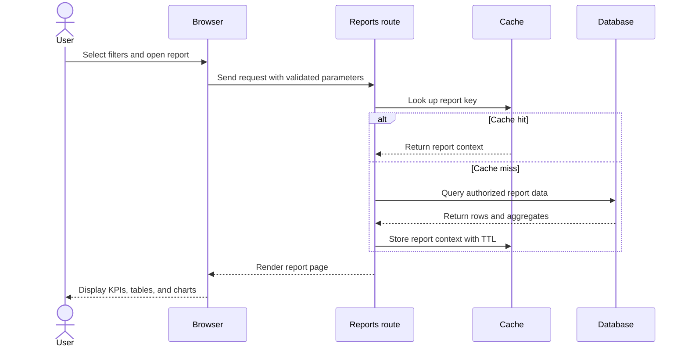

# Report Pages and Analytics Documentation

## Purpose

This document defines how to document report pages in a software project. It is tailored to the implemented InventoryLogix reports route and template, while remaining reusable for other applications.

The application report page is implemented through:

- Route: `app/routes/ui.py` — `reports()`
- Template: `app/templates/reports.html`
- Test coverage: `docs/Testing.md` — analytics and reports cases `REP-001` through `REP-008`

## Report-Page Catalogue

| Report page or section | Purpose | Main inputs | Main outputs | Evidence |
|---|---|---|---|---|
| Executive | Summarize operational and financial indicators | Date range and filters | KPIs, trend summaries, tables, charts | `reports.html`, `ui.py` |
| Warehouse | Compare warehouse stock and activity | Date range, warehouse filters | Warehouse breakdowns and status | `reports.html`, `ui.py` |
| Procurement | Support purchasing and supplier decisions | Date range, supplier/product filters | Procurement metrics and purchase-order data | `reports.html`, `ui.py` |
| Sales | Present sales-related reporting available in the implementation | Date range and filters | Sales metrics and comparisons | `reports.html`, `ui.py` |
| Inventory Health | Assess stock health and replenishment conditions | Date range, product/category/status filters | Stock, reorder, movement, and health indicators | `reports.html`, `ui.py` |

The exact labels and calculations must be checked against the current template and route before publication. A report heading must not be documented as an implemented metric if the route does not calculate it.

## Standard Documentation Template for Each Report

### 1. Report Name

State the name shown to the user and the route or navigation path used to open it.

### 2. Business Question

Explain the decision or operational question the report supports. For example: Which products require replenishment? How is warehouse activity changing? Which suppliers or purchase orders need attention?

### 3. User Roles

Identify which roles can view or export the report and whether any data is hidden or restricted by role.

### 4. Filters and Parameters

Document every supported parameter:

| Parameter | Type | Default | Validation | Effect on report | Evidence |
|---|---|---|---|---|---|
| Date range | Date or period | `[default]` | `[validation]` | `[sections affected]` | `[route/test]` |
| Product | Identifier or text | `[default]` | `[validation]` | `[sections affected]` | `[route/test]` |
| Supplier | Identifier or text | `[default]` | `[validation]` | `[sections affected]` | `[route/test]` |
| Warehouse | Identifier or text | `[default]` | `[validation]` | `[sections affected]` | `[route/test]` |
| Category/status | Enum or text | `[default]` | `[validation]` | `[sections affected]` | `[route/test]` |

### 5. Metrics and Calculations

For every KPI or chart, document:

- Metric name
- Definition
- Formula or aggregation
- Source table/query/service
- Date basis
- Filter behavior
- Rounding and currency
- Empty-data behavior
- Whether the value is measured, calculated, synthetic, or illustrative

Do not call a calculated model output a measured business result. For example, an AI savings estimate must be described as a model-derived estimate unless the repository contains a validated before-and-after measurement.

### 6. Tables, Charts, and Exports

Describe all visible tables, charts, labels, tooltips, downloads, and export formats. Record the authorized fields and the maximum export size where applicable.

### 7. Data Flow

Document the flow from request parameters to route validation, cache lookup, service/repository calls, database queries, aggregation, template context, and browser rendering.

The sequence diagram must be revised if the implementation uses a different flow.

### 8. Caching and Freshness

Document cache key inputs, TTL, invalidation after writes, process-local versus shared storage, and the behavior when cached data is unavailable.

### 9. Security and Privacy

Document authentication, role checks, SQL parameterization, query-parameter validation, export authorization, sensitive fields, and error handling. Include the relevant security tests.

### 10. Empty, Partial, and Error States

Every report should document behavior for:

- No matching records
- Partial data
- Invalid date ranges
- Reversed dates
- Future dates
- Database failure
- Cache failure
- Unauthorized access
- Export failure

The application’s test plan explicitly requires these cases under `REP-002`, `REP-006`, `REP-007`, and `REP-008`.

## Report Quality Checklist

- [ ] Report purpose is stated as a business question.
- [ ] Every displayed metric has a definition and source.
- [ ] Filters affect all relevant sections consistently.
- [ ] Date boundaries are documented.
- [ ] Currency and rounding rules are documented.
- [ ] Calculated estimates are not described as measured outcomes.
- [ ] Role permissions and export permissions are verified.
- [ ] Empty, partial, invalid, and failure states are documented.
- [ ] Cache freshness and invalidation are documented.
- [ ] Screenshots or evidence references are stored in the figure register.
- [ ] Report totals reconcile with operational data where required.
- [ ] Test cases link to the report behavior.

## InventoryLogix Report Evidence

The current project analysis identifies five report tabs: Executive, Warehouse, Procurement, Sales, and Inventory Health. The report route contains date-range normalization, report-data assembly, caching, and template rendering. The testing documentation requires validation of default ranges, multiple date ranges, reconciliation, filters, exports, no-data behavior, failure behavior, and injection safety. These facts should be retained in the final academic report and updated if the implementation changes.
