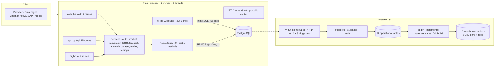

# InventoryLogix — Technical Architecture

**Merged from both analysis passes · September 10, 2026**
Evidence levels: E1 (direct code/git evidence) · E2 (strong inference) · E3 (interpretation).

## 1. System Architecture

Flask application-factory monolith with a nominal 4-layer stack. The
layering is real on the API side; the UI blueprint bypasses
services/repositories with ~56 inline `cur.execute` sites. DB triggers
backstop the leaks.



## 2. Bootstrap & Runtime Flow

1. `run.py:32` — `create_app(_default_env())`; env from `FLASK_ENV` or
   `RENDER_INSTANCE_ID` (run.py:25-29).
2. Production: Gunicorn `BaseApplication` (workers=1, threads=2,
   timeout=120, run.py:41-80) — documented rationale: one process = one
   shared pool + consistent in-memory state against PgBouncer. Windows
   dev falls back to Werkzeug (ImportError guard).
3. `create_app()` (app/__init__.py:31-85): config class → extensions →
   blueprints → context processors → error handlers (7 codes, DB-free
   inline HTML fallback at :192-256). CLI commands: init-db / seed-db /
   etl-db.
4. First-run bootstrap once per process (guarded against the
   debug-reloader parent via `WERKZEUG_RUN_MAIN`, __init__.py:77-83):
   `init_schema()` executes 5 SQL files in order (schema → procedures →
   warehouse → etl_procedures → triggers) → `seed_database()` →
   `etl_database()` (gated by `RUN_ETL_ON_STARTUP`).
5. Production fail-fast if DB resolves to localhost defaults
   (__init__.py:113-128).

Config classes: `Config` (env vars) → `DevelopmentConfig` (DEBUG),
`ProductionConfig` (secure cookies, no debug), `TestingConfig` (no CSRF).

## 3. Request → Database Data Flow

- **Pooling:** module-level dict of `ThreadedConnectionPool(1, 20)`
  keyed by `repr(sorted(params.items()))` (connection.py:33-67 — fragile
  key, E1). Per-request connection on Flask `g` (`g.db`), returned in
  `teardown_appcontext` with rollback-on-exception (connection.py:92-131).
  Keepalives + connect_timeout against remote idle disconnects.
- **Cursors:** all `RealDictCursor` — dict rows straight into templates.
- **Writes:** `sp_*` parameterized calls; triggers fire inside the
  transaction (validation + audit); `get_cursor(commit=True)` commits on
  success, rolls back on exception.
- **ETL:** dedicated connections outside the pool (correct — outside
  request scope); but `_open_conn` reads `current_app` (etl.py:38), so it
  requires app context (the background-thread bug root, §8).

### Trace: product creation
```
Browser → POST /api/products
  → @limiter.limit("30/min") → @login_required → @write_roles_required
  → ProductService.create(payload)
    → validate_payload() → ProductRepository.find_by_sku() (dup check)
    → ProductRepository.create() → sp_product_create() [SP]
    → trg_product_audit [TRIGGER → audit_log]
  → AuditRepository.record() → cache_bust_products()
  → api_response({"id": new_id}, status=201)
```

### Trace: stock movement
```
Browser → POST /api/movements
  → @limiter.limit("60/min") → @login_required → @write_roles_required
  → MovementService.record()
    → validate type ∈ {IN, OUT, ADJUSTMENT, RETURN}, qty > 0
    → ProductRepository.find_for_update() [SELECT … FOR UPDATE — the one
      deliberate SP bypass, for row-level concurrency]
    → compute new_stock; reject negative for OUT/ADJUSTMENT (service guard)
    → sp_movement_record() [INSERT]
      → trg_validate_movement [BEFORE INSERT]
        → auto-populate sku from product_id (never trusts caller)
        → reject unknown FK; reject negative-resulting OUT/ADJUSTMENT
      → trg_log_movement_create [AFTER INSERT → audit_log]
    → sp_product_set_stock() → trg_product_audit [audit]
  → AuditRepository.record("movement.record") [explicit audit row]
  → cache_bust_movements() → api_response(201)
```
Note: a movement produces multiple audit rows (trigger + service +
stock-update trigger) — redundant but complementary (trigger rows lack
user attribution; service rows have it). [E1]

## 4. Component Details

### 4.1 Security layer

**CSP nonces (headers.py):**
```python
@app.before_request
def _set_nonce(): g.csp_nonce = secrets.token_urlsafe(24)

@app.context_processor
def _inject_nonce(): return {"csp_nonce": getattr(g, "csp_nonce", "")}

@app.after_request   # script-src 'self' 'nonce-…' <3 CDNs>; style-src allows unsafe-inline
def _apply(response): ...
```
Templates: `<script nonce="{{ csp_nonce }}">` on every inline script and
import map. No `unsafe-inline` for scripts. **No SRI on CDN scripts**
(accepted tradeoff, §8).

**Rate limiting:** Flask-Limiter, `get_remote_address` key, 200/min
default; memory:// hardcoded in the constructor (extensions.py:19) —
`RATELIMIT_STORAGE_URI` env exists but is shadowed. Route limits:
login 10/min, register 5/min, forgot 5/hour (auth.py:16,40,61); product
reads 120/min; API writes 30/min (api.py:164-248); movements 60/min;
forecast/anomaly runs 30/min (ai.py:35,82). **Portfolio GETs unthrottled**
(ai.py:55-66, 105-118) — DoS vector, §8.

**Account lockout (auth_service.py:28-29, 66-86):** in-memory
`defaultdict` + `threading.Lock`; 5 attempts / 15 min, pruned on check,
cleared on success, audit rows on failures. **Per-process** — correct
only in the single-worker deployment.

**Password reset:** token = `secrets.token_urlsafe(48)`; stored **only
as SHA-256 hash**; single active token (purge before issue); 5-min TTL
default; DB-level `used = FALSE AND expires_at > NOW()` check; consume
sets `used = TRUE` — but lacks `WHERE used = FALSE` (tiny double-use race
window, E2).

**RBAC:** `WRITE_ROLES = ("admin","manager")` (roles.py:9);
`roles_required` aborts 403 (roles.py:12-25); must stack under
`@login_required`. All API writes have both decorators; 2 UI routes use
inline `current_user.role not in WRITE_ROLES` checks instead
(ui.py:580-582, 614-616). Self-registration always creates `viewer`.

### 4.2 Caching (utils/cache.py)

One thread-safe TTLCache class (LRU + expiry + prefix invalidation,
threading.Lock — cache.py:20-72), instantiated per concern:
products 120s, suppliers 120s, dashboard 60s, reports 300s, global 60s,
api 60s, landing 300s (**never used — dead instance**), monitoring 30s;
plus a 9th inside the AI blueprint (portfolio, 1h, max 10 entries).

- Read-through via `get_or_set(key, loader)`; writes call
  `cache_bust_*` prefix drops.
- **Two competing reorder-count context processors:** blueprint one
  cached 60s (ui.py:54-71); duplicate app-level one uncached per request
  (__init__.py:157-189). The "context processor cached 60s" claim only
  holds for the blueprint one.
- AI portfolio cache never busted (1h staleness by design).
- Manual ETL busts only `monitoring_cache`.
- All invalidation per-process — the single-worker deploy keeps it
  coherent.

### 4.3 ML layer

**Forecasting (forecasting.py):** Prophet (weekly seasonality on,
daily/yearly off; ≥14 points) → yhat bands; ARIMA(1,1,1) (≥20 points,
95% CI via get_forecast); ensemble = simple average; MA fallback (1.96σ
bands) below floors, on import failure, or on any exception. Accuracy =
in-sample MAPE on fitted values (optimistic); **fallback hardcodes
`accuracy: 78.0`** (:55 — synthetic). Prophet/ARIMA accuracy capped at
99.5.

**Anomaly (anomaly.py):** IsolationForest (contamination=0.05,
n_estimators=80, random_state=42) on a single reshaped column
(univariate — marginal over the z-score channel it sits beside, E1);
anomalies ranked by |z|, classified spike/drop; SPC z-score (mean, σ,
UCL = μ+3σ, LCL = max(0, μ−3σ)) at configurable threshold (default 3.0);
"confidence" = synthetic formula `abs(score)*35+60` clamped 60-99 (:49).
Fallback: pure z-score when sklearn missing / <14 points / forest error.

### 4.4 EOQ engine

Formula `√(2DS/H)` server-side (helpers.py:59-73, plus total-cost split)
mirrored client-side (eoq.js:27) — sync risk but keeps the calculator
instant; cost curve + 3-axis sensitivity grid (eoq_service.py:49-80);
raw-SQL product read at eoq_service.py:18-25 (the one place bypassing
the sp_* convention, E1).

## 5. Database Layer

- **74 SQL functions** (51 procedures.sql + 14 etl_procedures.sql + 9
  trigger functions), 8 CREATE TRIGGER, 49 indexes, 28 tables.
- **Integrity root:** `trg_validate_movement` (triggers.sql:196-225) —
  auto-populates SKU from product_id (never trusts caller), rejects
  unknown FKs, raises on negative-resulting OUT/ADJUSTMENT. Service-layer
  checks are a fast-fail convenience; the trigger is the backstop that
  no route, script, or manual psql session can bypass.
- **SCD Type 2:** `dim_product_scd`, `dim_supplier_scd`,
  `dim_warehouse_scd`, `dim_user` with valid_from/valid_to/is_current/
  row_hash + partial index on is_current; merge functions hash-skip
  unchanged rows (etl_procedures.sql).
- **ETL (etl.py):** incremental watermark `etl_state['last_movement_id']`
  (read/write helpers :74-88); skip when no new movements; single
  transaction with rollback on failure; `force=True` TRUNCATE rebuilds.
  **Stock-walk clamping:** `fact_inventory_daily` built by walking
  current stock backwards per SKU/day, clamping negative intermediates
  to 0 with a warning counter (etl.py:296-314). Event-warehouse ETL via
  `etl_full_build()` stored proc (8 steps, non-fatal failures).
- **RLS:** enabled on all public tables with zero policies —
  deny-by-default against Supabase PostgREST; app connects as owner and
  bypasses (migration 003).
- **Dead objects:** `trg_cleanup_stale_sessions` (function, no trigger);
  `fact_product_daily` (defined, never populated). [E1]
- **Alembic:** 001 duplicates the runtime bootstrap by executing the same
  5 SQL files; 002 (trigger/timezone fixes) and 003 (RLS) carry real
  incremental changes. The runtime bootstrap is the real deployment
  path; flask-migrate is declared but never wired (dead dep).

## 6. Frontend Architecture

- **Buildless:** CDN + import maps (CSP-nonce'd). Chart.js 4.4.0 UMD +
  datalabels global on every page; Plotly 2.27.0 lazy-loaded on exactly 4
  pages (dashboard, forecast, anomaly, EOQ); Three.js 0.160 via import
  map (auth-bg.js wave background on every page; app-bg.js/bg-3d.js/
  landing-bg.js orphaned — no template references, E1); GSAP 3.12.5 +
  ScrollTrigger entrance/scroll animations; dashboard-3d.js is pure CSS
  3D tilt (no Three.js); `prefers-reduced-motion` respected.
- **Theme:** dark default, localStorage toggle, theme-aware chart
  datalabels, CSS-variable-driven Three.js colors.
- **Error resilience:** 7 error-page templates + a hand-built DB-free
  inline HTML fallback so a DB outage still renders an error page.

## 7. Performance Characteristics

| Metric | Value | Notes |
|--------|-------|-------|
| DB connection pool | 20 max | ThreadedConnectionPool, keepalives |
| Gunicorn | 1 worker × 2 threads | Single process by documented design |
| Context processor cache | 60s | Blueprint-level only (duplicate app-level uncached) |
| Dashboard cache | Per-user/day | Resets daily |
| Reports cache | 300s | LRU max 20 entries — thrashes past 20 filter combos |
| AI portfolio cache | 3600s | Max 10 entries; never busted |
| Dashboard route queries | 11 inline + 2 repo = 13 | Down from 14 (batched FILTER agg) |
| Reports route queries | ~40 sequential per cold miss | Largest handler (~1156 lines) |
| Request timeout | 120s | Gunicorn |

## 8. Security Threat Findings (ranked, E1 unless noted)

1. **Committed credential** — live Supabase DSN with password in
   alembic.ini:7. Rotate + remove.
2. **Unthrottled AI portfolio endpoints** — user-controlled cache keys
   (`horizon` int, `contamination` float embedded in keys, ai.py:58-60,
   109-112) → unique key per request → model fit per request → CPU
   exhaustion by any authenticated **viewer**. Fix: `@limiter.limit` +
   clamp inputs.
3. **Multi-worker fragility** — lockout dict, memory:// limiter, 9
   caches, `_BOOTSTRAPPED` flag all per-process. A second worker
   silently multiplies auth limits ×2 and splits cache invalidation.
   Currently masked by the 1-worker deploy.
4. **Reset link in logs** — when neither SendGrid nor SMTP is
   configured, the full tokenized reset link is logged at WARNING
   (mailer.py:125-131). Redact.
5. **SECRET_KEY fallback** `"change-me-in-production"` with no
   production fail-fast (settings.py:17) — mirror the DB guard.
6. **CDN scripts without SRI** — 3 CDNs whitelisted in script-src;
   compromise = direct XSS channel. Fix: vendor/self-host with SRI.
7. **Registration user-enumeration** — distinct "username taken" /
   "email registered" messages (auth_service.py:49-52). Login and
   forgot-password are properly uniform.
8. **Background ETL thread** — `threading.Thread(target=_run)` (ui.py:1986)
   whose path reads `current_app` (etl.py:38) outside any app context →
   expected `RuntimeError`, swallowed by `except Exception` → **Run ETL
   button likely does nothing** (static analysis; runtime verification
   pending). Also no concurrency guard → double-click races the
   TRUNCATE-based full rebuild.
9. **render.yaml DB name mismatch** — declared `inventory_db_2ov0`
   (line 19) vs `fromDatabase.name: inventory-logix-db` (line 38) →
   Blueprint wiring broken as written.
10. Minor: reset-token consume race (§4.1); `session_token` attr lost on
    `user_loader` reload (DB session row may not close on logout, E2);
    internal exception strings surfaced to clients on forecast failure;
    no 2FA/CAPTCHA; reports route assembles SQL from interpolated
    hardcoded fragments (safe as written — all user values stay in %s
    tuples — but unguarded against future edits).

## 9. Scalability Profile

Ceiling: **2 concurrent in-flight requests** (1 worker × 2 threads) on
free-tier Postgres. Constraints in order: (a) 2-thread cap — any slow
query blocks half of capacity; (b) reports ~40-query battery; (c)
per-process state (limiter, lockout, caches, bootstrap, pools) blocks
horizontal scaling; (d) 20-conn pool per worker vs free-tier connection
budgets; (e) ML fits run in-request under the same threads; (f)
ETL-at-boot cold-start latency. Comfortable: low-tens concurrent internal
users. Upgrade path: Redis for limiter/lockout/caches (unshadow the env
var) → multi-worker + PgBouncer → read replicas/CDN. [E2/E3]

## 10. Maintainability

- ui.py: 2051 lines; `reports()` spans ~1156 lines / ~40 queries
  (ui.py:734-1890); `dashboard()` ~265 lines.
- Smells: two role-check styles; movement/EOQ logic duplicated UI vs
  API; duplicate context processors; `if 'reorder_by_supplier' in
  locals()` guard; dead cache/imports; fake fallback values
  (`units_today or 1248`, ui.py:113; empty-series fabrications).
- Repos: static-method classes — namespaces, easily monkeypatched in
  tests.
- Tests: 97 functions — ML 33, services 29, security 12, cache 8, roles
  7, auth 4, API 4, ETL 3. **Untested:** dashboard/reports/monitoring
  routes, lockout, reset-token flow, mailer, PO transitions, ETL thread,
  CSRF (disabled in TestingConfig).

## 11. Recommendations (evidence-backed)

1. Rotate + remove the committed DSN; add a SECRET_KEY prod fail-fast.
2. `@limiter.limit` + clamp horizon/contamination on portfolio routes.
3. Push app context into the ETL thread; add a module-level ETL lock.
4. Delete the uncached app-level context processor (keep the blueprint one).
5. `WHERE used = FALSE` in `sp_reset_token_consume`.
6. Redact the reset link from the SMTP-missing log line.
7. Fix the render.yaml DB-name mismatch.
8. Remove the hardcoded `storage_uri` kwarg so `RATELIMIT_STORAGE_URI` works.
9. When scaling past one worker: Redis-backed limiter + lockout; shared
   cache bus or shorter TTLs; capped per-worker pools behind PgBouncer.
10. Add tests for lockout, reset-token flow, and the ETL thread; split
    `reports()` into per-tab functions.

---

*Generated: September 10, 2026 · Merged from both analysis passes*
